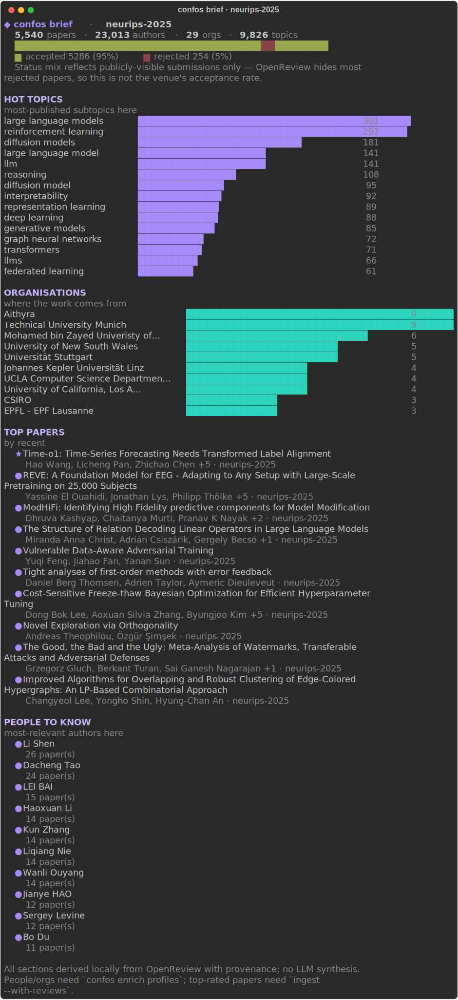
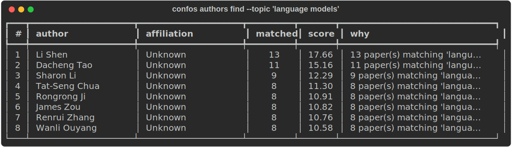
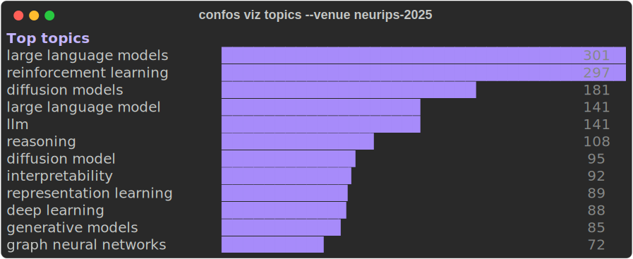
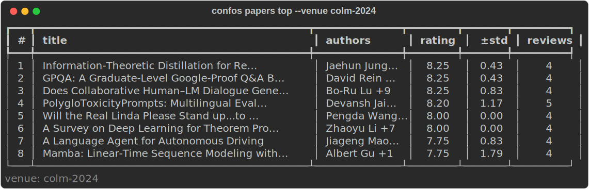

<div align="center">

# confos

**Conference intelligence in your terminal — for humans and agents.**

[](https://pypi.org/project/confos/)
[](https://pypi.org/project/confos/)
[](LICENSE)
[](https://github.com/RRaphaell/confos/actions/workflows/ci.yml)

</div>

`confos` turns AI/ML conferences (NeurIPS, ICLR, ICML, COLM, …) into a local, queryable
knowledge base. Ingest a venue once from OpenReview, then **search papers, find the people
working on a topic, see what's trending, visualize the landscape, and export agent-ready
context** — all locally, all scriptable, with provenance back to the source.

It's built for terminals, shell scripts, CI, and **coding agents** (Claude Code, Codex, or
anything with shell access). Every command speaks stable JSON; after a one-time ingest every
query is local, offline, and millisecond-fast — and unlike asking an LLM, every number is
real and traceable, not guessed.

Run `confos brief --venue neurips-2025` and the whole conference lands in one screen — a
colored dashboard in your terminal:

<p align="center">
  
</p>

<details>
<summary>Plain-text version (for piping / screen readers)</summary>

```text
◆ confos brief · neurips-2025
  5,540 papers · 23,013 authors · 29 orgs · 9,826 topics
  ████████████████████████████████████████████████
  ▆ accepted 5286 (95%)   ▆ rejected 254 (5%)
  Status mix reflects publicly-visible submissions only — OpenReview hides most
  rejected papers, so this is not the venue's acceptance rate.

HOT TOPICS
most-published subtopics here
large language models    ████████████████████████████████████████  301
reinforcement learning   ███████████████████████████████████████▌  297
diffusion models         ████████████████████████                  181
reasoning                ██████████████▍                           108
interpretability         ████████████▎                              92
```

</details>

## What it looks like

**Find the people working on a topic** — ranked, with a why-relevant reason and provenance:

<p align="center">
  
</p>

**See what's trending** — colored topic bars straight in the terminal:

<p align="center">
  
</p>

**Surface the best-reviewed work** — mean rating, spread, and review count from public reviews:

<p align="center">
  
</p>

---

## Install

Requires **Python 3.12+**.

```bash
uv tool install confos     # recommended — isolated global install
pipx install confos        # alternative isolated install
pip install confos         # plain pip
uvx confos --help          # run once, without installing
```

Upgrade later with `uv tool upgrade confos` (or `pipx upgrade confos`).

## Quickstart

```bash
confos init                          # one-time: create the local store at ~/.confos
confos ingest neurips-2025           # pull a venue from OpenReview (network, a few minutes)
confos brief --venue neurips-2025    # the dashboard: topics, orgs, top papers, people
```

Not sure of a venue slug? `confos venues search "ICLR 2026"` or `confos venues aliases`.
After the one-time ingest, everything is **local and offline**.

## Commands

confos is organized into a few groups. Every command supports `--json` (a stable envelope for
agents/scripts) and `--plain` (TSV); the default is a rich human view. Run `confos <group>
--help` for flags, or `confos schema <command>` for the exact JSON contract.

### Setup & data

| Command | What it does |
|---|---|
| `confos init` | Create the local store (`~/.confos`). |
| `confos ingest <venue> [--with-reviews] [--force] [--dry-run]` | Pull a venue's full submission set from OpenReview. `--with-reviews` also fetches review scores; re-running does an incremental update. |
| `confos enrich profiles --venue <v>` | Fetch author profiles → affiliations, countries, homepage/Scholar/DBLP. Powers the org & country stats. |
| `confos index rebuild` · `confos index status` | Re-derive the index from the raw snapshots, offline · show row counts. |
| `confos venues list \| search <q> \| show <slug> \| add \| aliases` | Discover and register venues. |
| `confos doctor` | Check the environment, store, FTS5, and the OpenReview backend. |

### Search & explore papers

| Command | What it does |
|---|---|
| `confos papers search <query> [--venue --year --org --accepted-only --limit]` | Full-text search over title/abstract/keywords, ranked and cited. |
| `confos papers show <id> [--with related]` | A reading-friendly card: authors, abstract, and links. |
| `confos papers related <id>` | Papers similar by title/keyword overlap. |
| `confos papers top [--topic --venue]` | Highest-rated papers (needs `ingest --with-reviews`). |
| `confos papers controversial [--topic --venue]` | The most divisive papers — highest rating variance. |

```bash
confos papers search "long-running agents" --venue neurips-2025 --limit 20
confos papers search "tool use" --accepted-only --json | jq '.data[].title'
```

### People

| Command | What it does |
|---|---|
| `confos authors find --topic <t> [--venue]` | **Rank the people actually working on a topic** — with their papers, affiliation, and a why-relevant explanation. |
| `confos authors search <name>` | Find an author by name. |
| `confos authors show <id>` | Author detail. |
| `confos authors papers <id> [--venue]` | An author's papers. |
| `confos authors coauthors <id>` | Their collaborators, ranked by shared papers. |

### Organisations

| Command | What it does |
|---|---|
| `confos orgs top [--venue]` | Top organisations by paper count. |
| `confos orgs papers <org> [--venue]` | Papers affiliated with an organisation. |

> Org & country data is populated by `confos enrich profiles` — coverage is sparse without it,
> and confos is always honest about that.

### Stats & trends

| Command | What it does |
|---|---|
| `confos stats overview \| topics \| orgs \| countries [--explain]` | Honest aggregates — every stat reports its data-quality. |
| `confos trends topic <t> --venues a,b,c` | How a topic moves across venues / years. |
| `confos trends compare <a> <b> --topic <t>` | Two venues, head-to-head. |

### Visualize

| Command | What it does |
|---|---|
| `confos viz topics \| orgs [--venue]` | Colored terminal bar charts. |
| `confos viz network --topic <t> [--format terminal\|mermaid\|html]` | Co-authorship graph — view in-terminal or export Mermaid/HTML. |

### Brief & export

| Command | What it does |
|---|---|
| `confos brief --venue <v> [--topic <t>]` | **The one-command dashboard** (pictured above): overview, hot topics, rising orgs, top papers, people-to-know. |
| `confos export context --topic <t> [--format json\|markdown]` | A self-contained, cited **context pack** purpose-built for agents. |
| `confos export papers \| authors [--format csv\|jsonl]` | Bulk data dumps. |
| `confos schema <command>` | Print the stable JSON output contract for a command. |

## Output modes — human, agent, script

Three modes, switchable on any command:

| Mode | Flag | For |
|---|---|---|
| **Human** | *(default)* | A rich, colored view — tables, the `brief` dashboard, clickable titles. Degrades to plain text on a pipe / `NO_COLOR` / a dumb terminal. |
| **JSON** | `--json` | A stable, versioned envelope (`schema_version` · `data` · `provenance`) — the contract agents and scripts depend on. `confos schema <cmd>` documents it. |
| **Plain** | `--plain` | Line/TSV output for `grep` / `awk` / `cut`. |

`stdout` carries only the requested data; progress and warnings go to `stderr`, so a
`--json` command stays parseable even mid-ingest.

## For agents

confos is a first-class tool for coding agents (Claude Code, Codex, …):

- **Stable JSON** on every command, with a documented schema and provenance — the agent never
  has to hallucinate a statistic.
- **`confos export context --topic <t>`** returns one cited pack (top papers, ranked people,
  orgs, topic-scoped stats) — drop it straight into a prompt.
- A **bundled skill** (`.agents/skills/confos/`) teaches an agent how to drive the tool. See
  [AGENTS.md](AGENTS.md).

## How it works

A one-time `ingest` snapshots a venue's raw notes to JSONL (the source of truth) and derives a
local **SQLite + FTS5** index. Every query after that is local, offline, and deterministic, with
each result traceable to its OpenReview source. OpenReview is the only source today; more
adapters, semantic search, an LLM `ask`, and an MCP server are designed-for-later (the seams
exist). See [docs/ARCHITECTURE.md](docs/ARCHITECTURE.md).

## Documentation

| Doc | What's in it |
|---|---|
| [docs/PRODUCT.md](docs/PRODUCT.md) | Goal, the wedge, who it's for, worked examples for every capability |
| [docs/ARCHITECTURE.md](docs/ARCHITECTURE.md) | System design, diagrams, components, data model, stack |
| [docs/CLI_CONTRACT.md](docs/CLI_CONTRACT.md) | Full command tree, flags, output contract, exit codes, safety |
| [docs/SCHEMAS.md](docs/SCHEMAS.md) | Stable `--json` output shapes (the agent/script contract) |
| [docs/RANKING.md](docs/RANKING.md) | How `authors find` ranks people, and how `--topic` matching works |
| [docs/VISUAL.md](docs/VISUAL.md) | The human-output visual layer — theme, semantic color, the brief dashboard, links |
| [AGENTS.md](AGENTS.md) | How an agent should drive confos |
| [CONTRIBUTING.md](CONTRIBUTING.md) | Setup, the gate (ruff + mypy + pytest), layering rules |

## Contributing

Contributions welcome — see [CONTRIBUTING.md](CONTRIBUTING.md) for setup and the gate. The opt-in
`scripts/live-test.sh` exercises the real OpenReview API before a release.

```bash
git clone https://github.com/RRaphaell/confos && cd confos
uv sync && uv run confos --help
```

## License

MIT — see [LICENSE](LICENSE).
</content>
</invoke>
